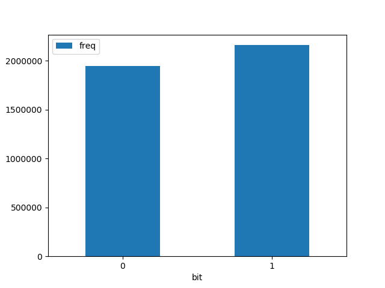
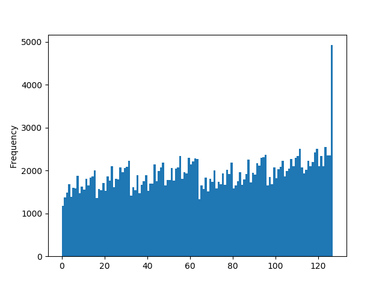

# Cockatoo: A True Random Number Generator
### On Going Research Project
A random number generator based on audio data that creates cryptographically secure keys.

### Things To Note

- Based on the data I've collected thus far. Audio data distribution is heavily dependent on the senstity of your mic. 

- Hard to collect consistent data sets because recording the same audio twice is nearly impossible. 

- Based on this [article](https://engineering.mit.edu/engage/ask-an-engineer/can-a-computer-generate-a-truly-random-number/) written by Jason M. Rubin. Atmospheric noise is considered random and unpredictable. This means, by nature, audio of atmospheric noise recorded at runtime is considered a good seed to generate random numbers.

- As it stands today, this program generates keys with a Shannon Entropy score of around 6 consistently. The standard for what is acceptable is 3.5. This means that the keys generated from this program are beyond the point of acceptable. 

- The seed data from which the keys are generated is uniformly distributed on the bit level and at the individual character level proving that the numbers generated are truly random. 

### Bit Data

### Character Data

- Note that the last value is just a bug with pandas and that it falls within the same frequency range as the rest of the values
